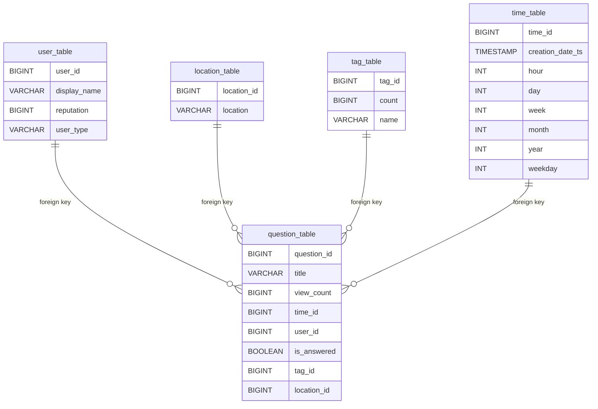

# Project: Data Engineering Capstone Project

## Project Overview

This project has the objective of analyzing the data of questions from stackoverflow, a question and answer site for professional and enthusiastic programmers. Stackoverflow have 21 million questions, 32 million answers, 81 million comments and 61 thousand tags database (https://data.stackexchange.com/)

Stackoverflow makes their data available in 2 ways:
1 - Download the data dump in XML format from https://archive.org/details/stackexchange. 
2 - Acess the data using their JSON API (https://api.stackexchange.com/)

For this project, we will use the second method, using the API. It was created an ETL pipeline to: 
1 - Extract the data from the API in json format
2 - Compress the data in parquet files
3 - Send parquet files to S3
4 - Load data from S3 to redshift staging tables
5 - Transform data from staging tables to a data warehouse model in redshift.


## Project Datasets

For this project, we'll be using 3 datasets from the stackoverflow API. To increase requests per day from 300 to 10.000 (100 rows x 10.000 requests = 1.000.000 lines/day), register application on Stack Apps (http://stackapps.com/apps/oauth/register). This project already contains the first 100 files for each dataset if you don't want to register (10.000 lines each dataset).

### Questions Dataset

The questions dataset is the real data of questions from Stackoverflow. Each file is in JSON format and is used to populate data dimension table and questions fact table.

Questions data:
```
https://api.stackexchange.com/2.3/questions?pagesize=100&order=asc&sort=creation&site=stackoverflow
```

Example of what a question file looks like:

```
    {
      "tags": [
        "c#",
        "floating-point",
        "type-conversion",
        "double",
        "decimal"
      ],
      "owner": {
        "account_id": 6,
        "reputation": 1787,
        "user_id": 8,
        "user_type": "registered",
        "profile_image": "https://www.gravatar.com/avatar/c7ec7dec48168d2a7d792e2b0acc78d1?s=128&d=identicon&r=PG",
        "display_name": "Eggs McLaren",
        "link": "https://stackoverflow.com/users/8/eggs-mclaren"
      },
      "is_answered": true,
      "view_count": 58471,
      "protected_date": 1442965259,
      "accepted_answer_id": 7,
      "answer_count": 14,
      "community_owned_date": 1351701767,
      "score": 724,
      "last_activity_date": 1614310275,
      "creation_date": 1217540572,
      "last_edit_date": 1614310275,
      "question_id": 4,
      "content_license": "CC BY-SA 4.0",
      "link": "https://stackoverflow.com/questions/4/how-to-convert-a-decimal-to-a-double-in-c",
      "title": "How to convert a Decimal to a Double in C#?"
    }
```

### Users Dataset

The users dataset is the real data of users from Stackoverflow. Each file is in JSON format and is used to populate users and location dimension table.

Users data:
```
https://api.stackexchange.com/2.3/users?pagesize=99&order=asc&sort=creation&site=stackoverflow
```

Example of what a user file looks like:

```
    {
      "badge_counts": {
        "bronze": 0,
        "silver": 1,
        "gold": 0
      },
      "account_id": -1,
      "is_employee": false,
      "last_modified_date": 1623827663,
      "last_access_date": 1219709813,
      "reputation_change_year": 0,
      "reputation_change_quarter": 0,
      "reputation_change_month": 0,
      "reputation_change_week": 0,
      "reputation_change_day": 0,
      "reputation": 1,
      "creation_date": 1217462400,
      "user_type": "moderator",
      "user_id": -1,
      "location": "on the server farm",
      "website_url": "https://meta.stackexchange.com",
      "link": "https://stackoverflow.com/users/-1/community",
      "profile_image": "https://www.gravatar.com/avatar/a007be5a61f6aa8f3e85ae2fc18dd66e?s=128&d=identicon&r=PG",
      "display_name": "Community"
    }
```

### Tags Dataset

The tags dataset is the real data of tags from Stackoverflow. Each file is in JSON format and is used to populate tags dimension table.

Question data:
```
https://api.stackexchange.com/2.3/tags?pagesize=99&order=desc&sort=popular&site=stackoverflow
```

Example of what a tag file looks like:

```
    {
      "has_synonyms": true,
      "is_moderator_only": false,
      "is_required": false,
      "count": 2242564,
      "name": "javascript"
    }
```


## Data Modeling

The modeling created was a star schema to optimize queries on questions analysis.


## Data Structure and Dictionary

### Staging Tables

staging_questions - records of questions dataset from stackoverflow

| Column | Data Type | Description|
| ------ | ---- | ---- |
| `question_id` | `BIGINT` |  Unique question identifier |
| `title` | `VARCHAR` |  Title of the question |
| `view_count` | `BIGINT` |  View count of the question |
| `creation_date` | `BIGINT` | Creation date of the question in unix format |
| `user_id` | `BIGINT` | Unique user identifier who created the question |
| `is_answered` | `BOOLEAN` | Flag if the question was answered |
| `tags` | `VARCHAR` | Question tags |
        
staging_users - records of users dataset from stackoverflow

| Column | Data Type | Description|
| ------ | ---- | ---- |
| `user_id` | `BIGINT` |  Unique user identifier |
| `display_name` | `VARCHAR` |  Name of the user that is displayed in stackoverflow |
| `reputation` | `BIGINT` |  Reputation of the user |
| `user_type` | `VARCHAR` | Type of user |
| `location` | `VARCHAR` | Location of the user |

staging_tags - records of tags dataset from stackoverflow

| Column | Data Type | Description|
| ------ | ---- | ---- |
| `count` | `BIGINT` |  How many times the tag was used |
| `name` | `VARCHAR` |  Name of the tag |


### Fact Table

question_table - records of questions associated with users and tags

| Column | Data Type | Nullable | Constraint | Description |
| ------ | ---- | ---- | ------ | ---- |
| `question_id` | `BIGINT` | `NO` |  | Unique question identifier |
| `title` | `VARCHAR` | `NO` |  | Title of the question |
| `view_count` | `BIGINT` | `NO` |  | View count of the question |
| `time_id` | `BIGINT` | `NO` |  | Unique time identifier based in the unix format |
| `user_id` | `BIGINT` | `YES` |  | Unique user identifier who created the question |
| `is_answered` | `BOOLEAN` | `YES` |  | Flag if the question was answered |
| `tag_id` | `INT` | `BIGINT` |  | Unique tag identifier |
| `location_id` | `BIGINT` | `YES` |  | Unique locaation identifier |

### Dimension Tables

user_table - users in stackoverflow

| Column | Data Type | Nullable | Constraint | Description |
| ------ | ---- | ---- | ------ | ---- |
| `user_id` | `BIGINT` | `NO` | `PRIMARY KEY` | Unique user identifier who created the question |
| `display_name` | `VARCHAR` | `YES` |  | Name of the user that is displayed in stackoverflow |
| `reputation` | `BIGINT` | `YES` |  | Reputation of the user |
| `user_type` | `VARCHAR` | `YES` |  | Type of user |

location_table - location of users who created questions

| Column | Data Type | Nullable | Constraint | Description 
| ------ | ---- | ---- | ------ | ---- |
| `location_id` | `BIGINT` | `NO` | `IDENTITY(0,1)` | Unique locaation identifier |
| `location` | `VARCHAR` | `YES` |  | Location of the user 

tag_table - tags used to filter questions

| Column | Data Type | Nullable | Constraint | Description 
| ------ | ---- | ---- | ------ | ---- |
| `tag_id` | `BIGINT` | `NO` | `IDENTITY(0,1)` | Unique tag identifier |
| `count` | `BIGINT` | `YES` |  | How many times the tag was used |
| `name` | `VARCHAR` | `NO` |  | Name of the tag

time - timestamps of created questions

| Column | Data Type | Nullable | Constraint | Description 
| ------ | ---- | ---- | ------ | ---- |
| `time_id` | `BIGINT` | `NO` | `PRIMARY KEY` | Unique time identifier based in the unix format |
| `creation_date_ts` | `TIMESTAMP` | `NO` |  | Creation date of the question in timestamp |
| `hour` | `INT` | `YES` |  | Hour of creation date |
| `day` | `INT` | `YES` |  | Day of creation date |
| `week` | `INT` | `YES` |  | Week of creation date |
| `month` | `INT` | `YES` |  | Month of creation date |
| `year` | `INT` | `YES` |  | Year of creation date |
| `weekday` | `INT` | `YES` |  | Weekday of creation date |


## Operating instructions

Register application on Stack Apps (http://stackapps.com/apps/oauth/register) to increase requests per day from 300 to 10.000 (100 rows x 10.000 requests = 1.000.000 lines/day)

Run the script collect_data.py  in terminal to collect data from the API. Inform your application key and set how many requests you want to make for each dataset (default 100).

```
# stackoverflow Application Key
Key = 'Inform your application key'
```

```
python3 collect_data.py
``` 

Use the script create_services.ipynb to create the services EC2, IAM and Redshift in AWS. 

Edit the file `dwh.cfg` in the same folder as this notebook and inform your AWS secret and access key and information about database and IAM user (this must have `AdministratorAccess`, from `Attach existing policies directly` tab).

Run the explore_data.ipynb notebook to check data structure and to manually create parquet files and upload them to S3 if needed.

Run the script create_tables.py in terminal to drop and create your tables in Redshift

```
python3 create_tables.py
```

Run the script etl.py in terminal to compress data from json files to parquet files, upload parquet files to S3, load data from parquet files to staging tables in redshift and load from staging tables in Redshift to analytic tables in Redshift.

```
python3 etl.py
```

Use the script create_services.ipynb to check data quality in the staging, fact and dimension tables.


## Files Included

In addition to the data files, the project workspace includes six files:

**collect_data.py** - collect data from stackoverflow API to local json files

**create_services.ipynb** - used to create the services EC2, IAM and Redshift in AWS and to test the data in the staging, fact and dimension tables.

**create_tables.py** - drops and creates your tables in Redshift.

**data_test.ipynb.ipynb** - notebook to query analytic tables 

**dwh.cfg** - contains information about AWS secret and access key, IAM Role, S3 (source data) and Redshift Cluster.

**etl.py** - compress data from json files to parquet files, upload parquet files to S3, load data from parquet files to staging tables in redshift and load from staging tables in Redshift to analytic tables in Redshift.

**explore_data.ipynb** - explore data from the API and manually create parquet files and upload them to S3. 

**sql_queries.py** - contains sql queries to create/delete al tables, load from S3 to staging tables in Redshift and load from staging tables in Redshift to analytic tables in Redshift.

**README.md** - contains Project Overview, Project Datasets, Data Modeling and Operating instructions.


## Project Write Up

**Technologies and Tools**

* From the 2 possible methods of obtaining data (download XML and JSON API), API were the choise since it's the only way to always get the most recent data and it's a cleaner solution.
* Python and Spark were the technologies used to process the data for their wide range of libraries.
* For file formats, it was used JSON as the source data from the API and Parque files to be compressed to S3.
* The storage used was Amazon S3 for their elastic infrastructure if data volume increases.
* Redshift was the analytical database, optimized for aggregation, good performance for read-heavy workloads.

### Scenarios

* Data increase by 100x.
  * Source data should be directly uploaded to S3.
  * Multithread the API requests to deal with increased writing.
  * Increase EMR cluster size to deal with volume of data.
  * Clustered Spark should be used to enable parallel processing of the data.

* Pipelines were to run on a daily basis by 7am.
  * Use Apache Airflow to schedule daily DAGs to obtain data and load them do S3 and Redshift.
  * Customized email on any of the task failure should be implemented.
  * Since data is incremental, data will still be avaiable in Dashboards from previous loads.
  
* database needed to be accessed by 100+ people.
  * Concurrency limit for Amazon Redshift cluster should be defined.
  * Clusters can be added or removed as needed.
